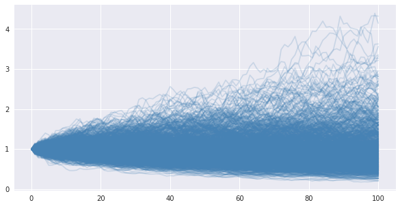
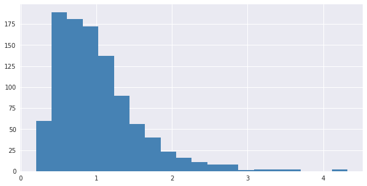
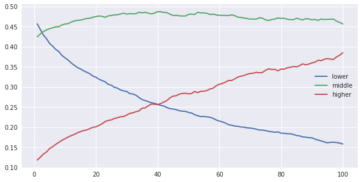

# Wealth inequality simulations
## First simulation
code: [./first_sim.ipynb](./first_sim.ipynb)
### Assumptions
- the percent change of any single person's wealth from one time step to the next is random, normally distributed around 0% with standard deviation 5% and is most 100% and least -100%
- a population of 1,000 people all start with wealth 1
- iterate for 100 time steps

### Results

Wealths over time:

A small number of wealths increase to 3-5X initial wealth, most wealths stay around 1.

Histogram of wealth values at the last time step:

#### By class
At each time step define the class of a person's wealth: *higher* if > 90th percentile, *lower* if < 50%, else *middle*. The percent of all wealth in each class over time:

Higher and middle class ownership increase (higher more so than middle) at the expense of lower class.

# Next steps
- [ ] what if distribution of wealth percent change is tighter for higher wealths, i.e. lower wealth values have greater chance of large changes than higher?
- [ ] effect of different progressive tax schemes?